### **SOC MONITOR REAL WORLD ATTACK DETECTION** 

#### Overview

This project simulates a real-world Security Operations Center (SOC) workflow by executing cyber attacks, collecting logs, forwarding them to a SIEM, and detecting malicious activity using Splunk.

The focus is on detection engineering and analysis, not just attack execution.

#### Objectives

Simulate SSH brute force and SQL injection attacks

Collect logs from system and web services

Forward logs to Splunk SIEM

Detect attacks using custom queries

Trigger alerts for suspicious activity

Visualize threats using dashboards

#### 

Tools \& Technologies

---

Kali Linux (Attack Simulation)

Hydra (Brute-force tool)

Burp Suite (Web attack testing)

Ubuntu Server (Target system)

Docker (Juice Shop deployment)

Splunk Enterprise (SIEM)

Splunk Universal Forwarder (Log forwarding)

#### Lab Architecture

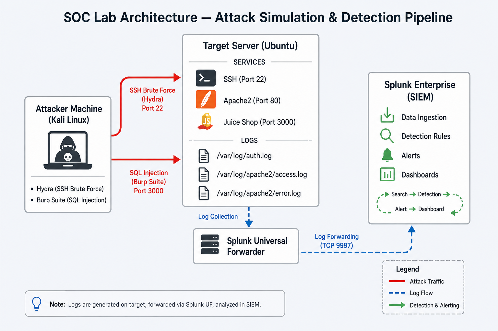

SOC Lab Architecture showing attack flow, log forwarding, and SIEM detection

#### Environment Setup

Component  Description                             

Attacker   Kali Linux (Hydra, Burp Suite)           

Target     Ubuntu Server (SSH, Apache2, Juice Shop) 

SIEM       Splunk Enterprise                        

Logs       auth.log, access.log, error.log          

#### **Implementation Steps**

##### Network Connectivity

Verifying connectivity between attacker and target system.

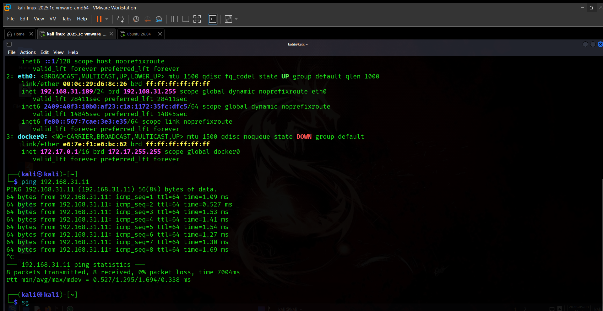

##### Services Running

SSH and Apache services are started on the target server.

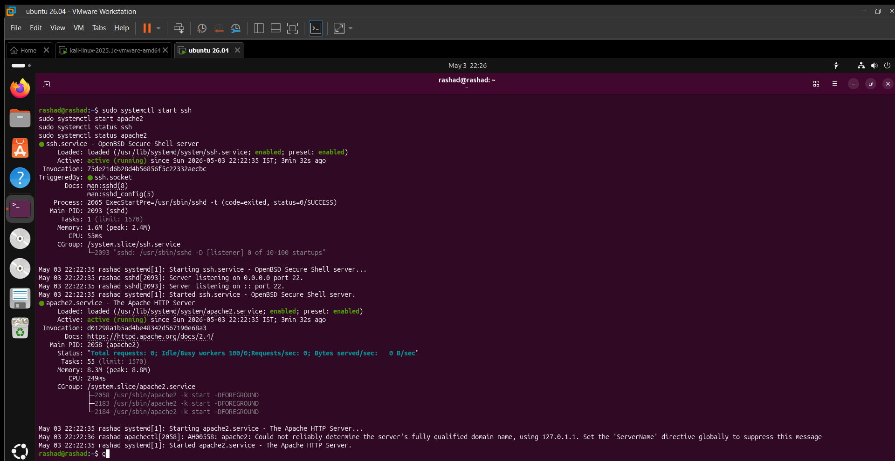

##### Juice Shop Application

OWASP Juice Shop deployed and accessible via browser.

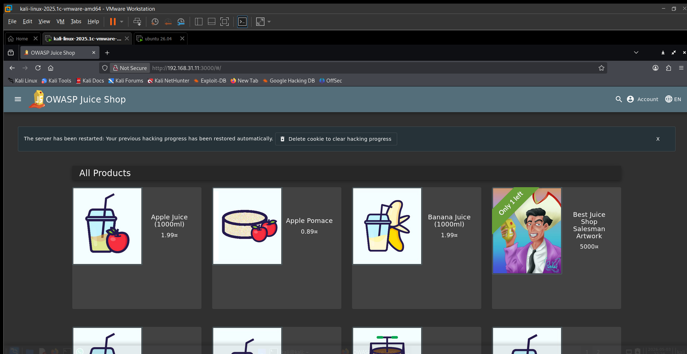

##### Log Monitoring

System and web logs are actively monitored.

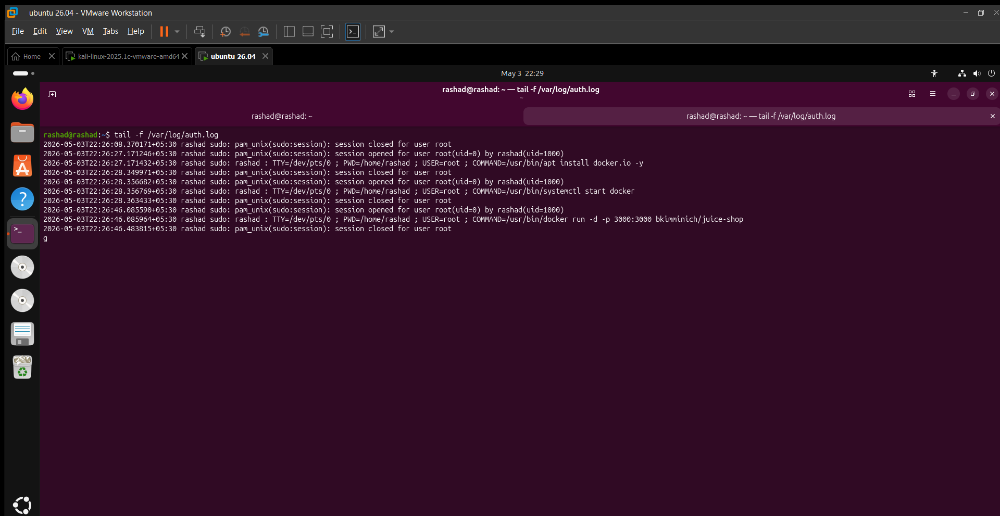
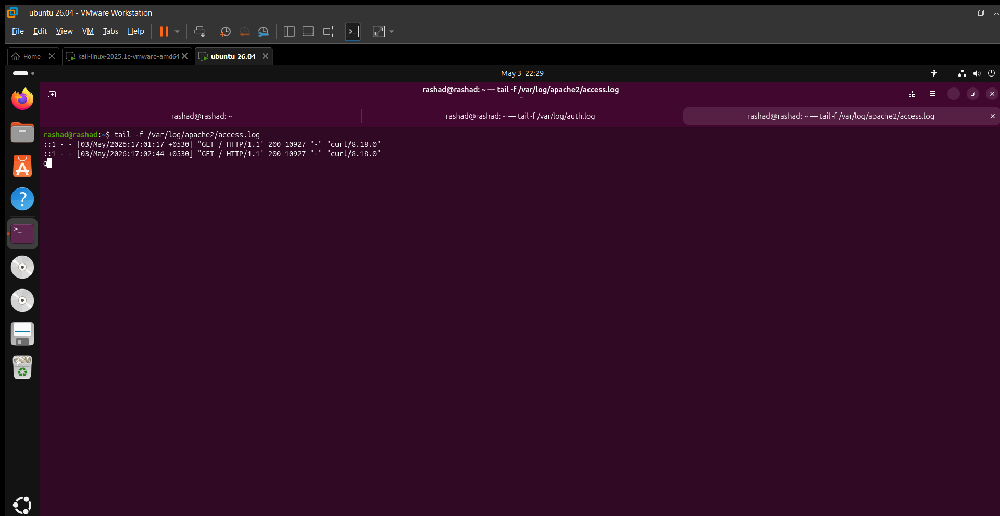

##### Splunk Forwarder Setup

Logs configured for forwarding to Splunk SIEM.

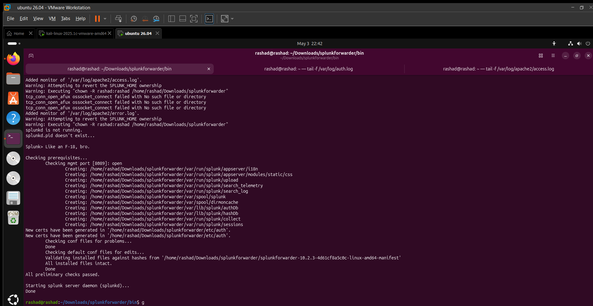

#### **Data Ingestion**

Logs successfully indexed in Splunk.

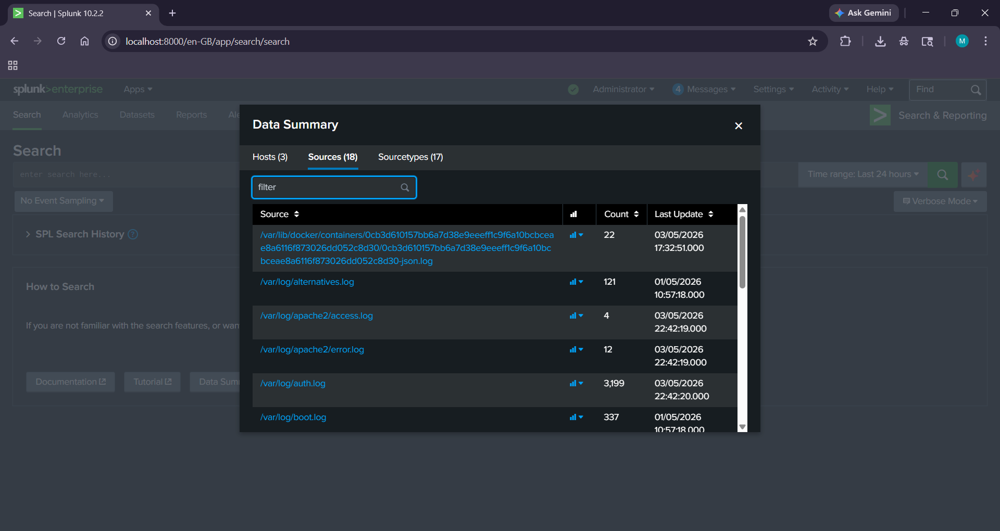

##### Attack Simulation

###### Brute Force Attack (SSH)

Hydra used to perform brute force attack on SSH service.

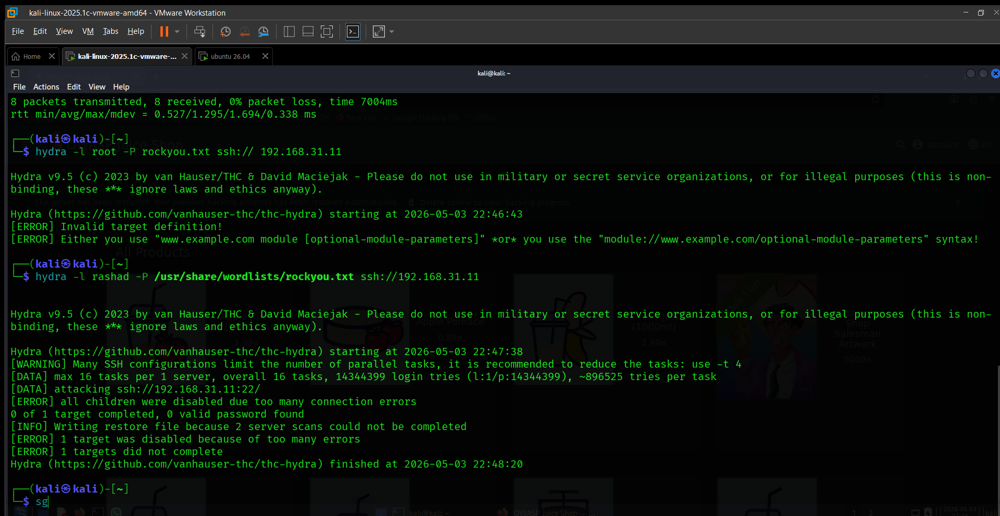

###### Failed Login Evidence

Multiple failed login attempts recorded in system logs.

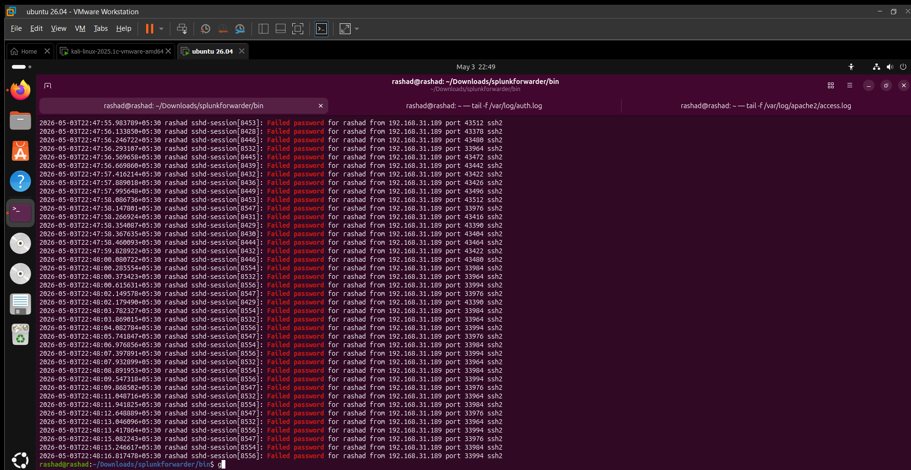

#### Detection Engineering

###### Brute Force Detection

index=\* "Failed password"

| bin \_time span=1m

| stats count by src\_ip, \_time

| where count > 10

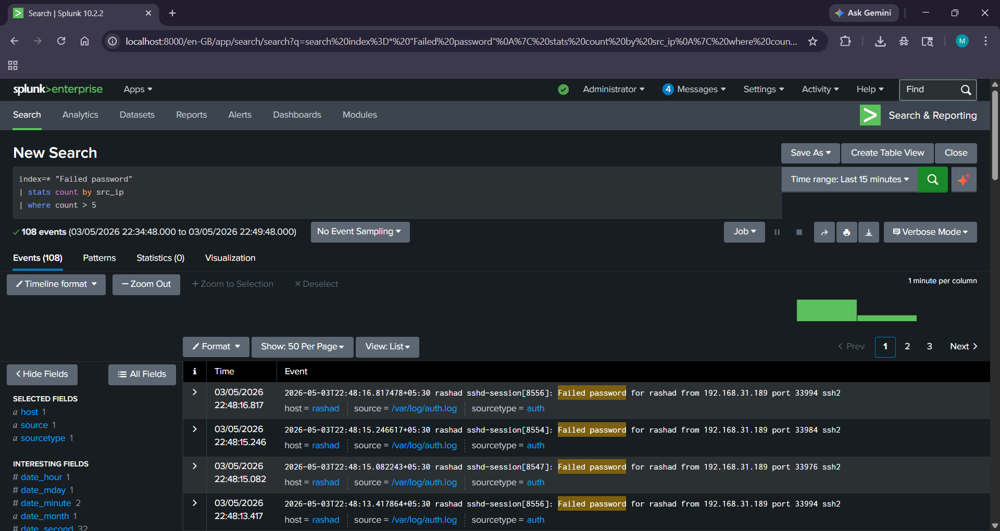

#### Alert Triggered

Splunk alert generated for brute force activity.

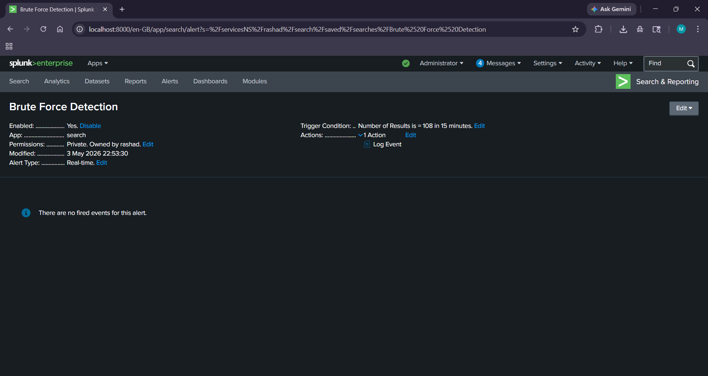

##### 

##### SQL Injection Attack

SQL injection executed using Burp Suite.

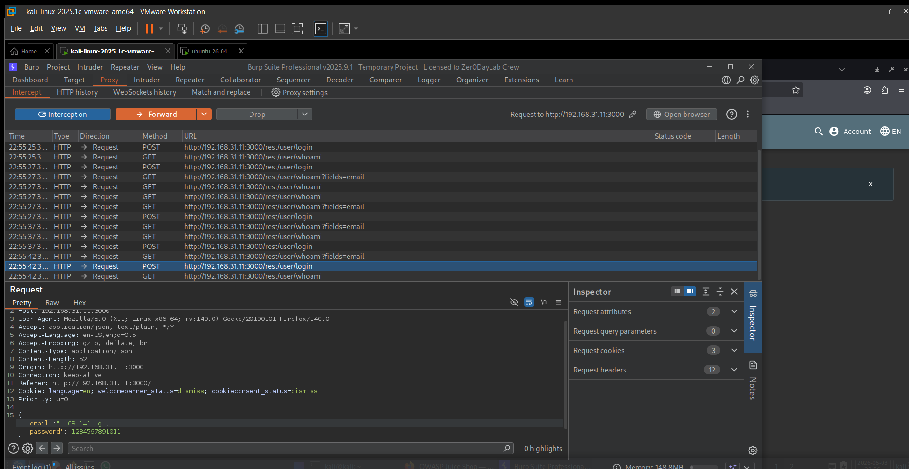

##### Web Log Evidence

Malicious requests captured in Apache logs.

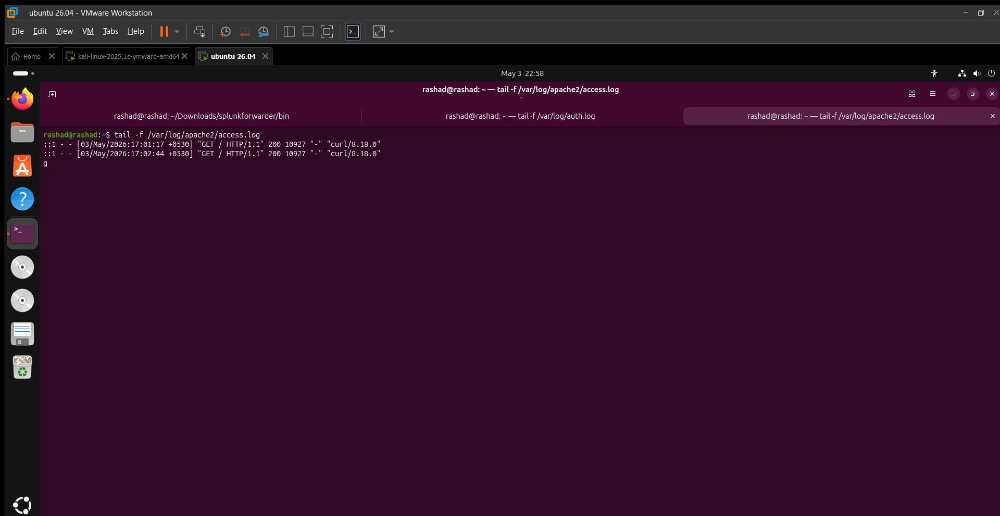

##### 

##### SQL Injection Detection

index=\* 

| regex \_raw="(?i)(\\bor\\b\\s+1=1|--|#)"

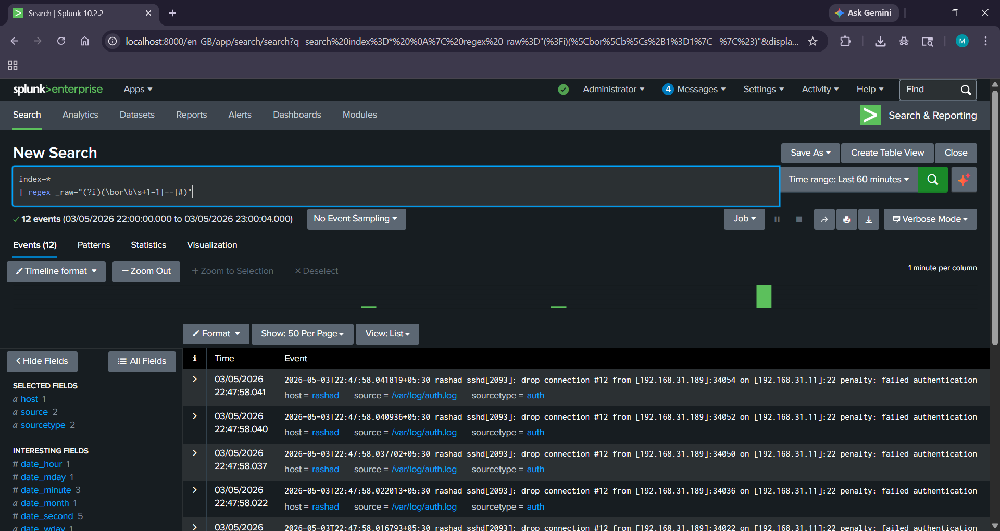

##### Dashboard

Centralized visualization of attack activity and alerts.

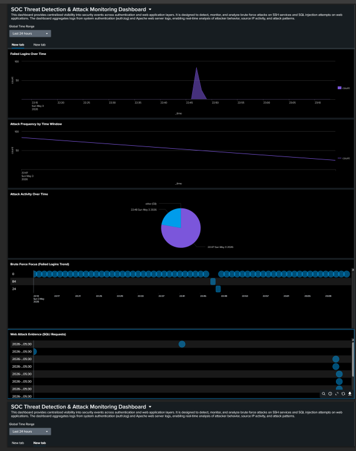

##### Alerting

Alerts configured in Splunk with:

&#x20;Trigger Condition: Number of results > 0

&#x20;Trigger Mode: Per Result

##### Limitations

Static thresholds may generate false positives

No threat intelligence enrichment

Limited log sources

No automated response

##### Key Learnings

Detection is more important than attack execution

Logs must be analyzed, not just collected

SIEM effectiveness depends on detection logic

Real SOC work involves investigation and correlation

##### Conclusion

This project demonstrates a complete SOC workflow:

Attack → Log Generation → Forwarding → Detection → Alerting → Visualization

It highlights how security analysts detect and respond to real-world threats using SIEM tools.

